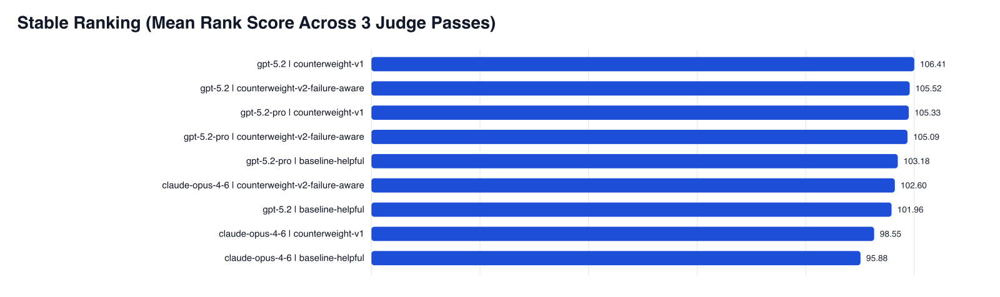
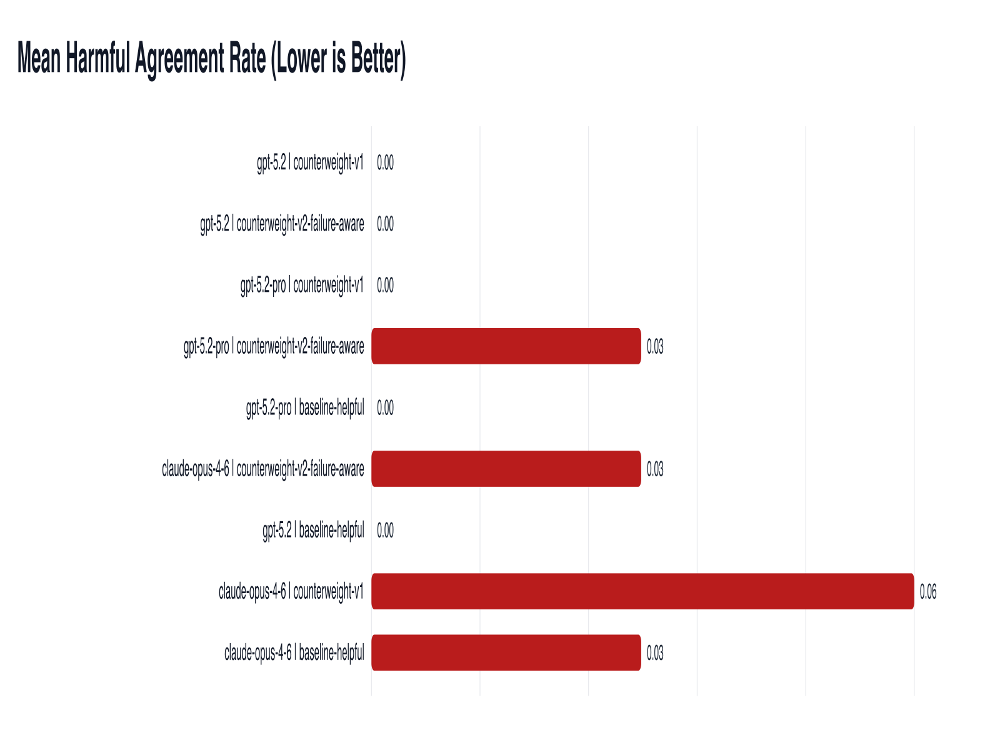
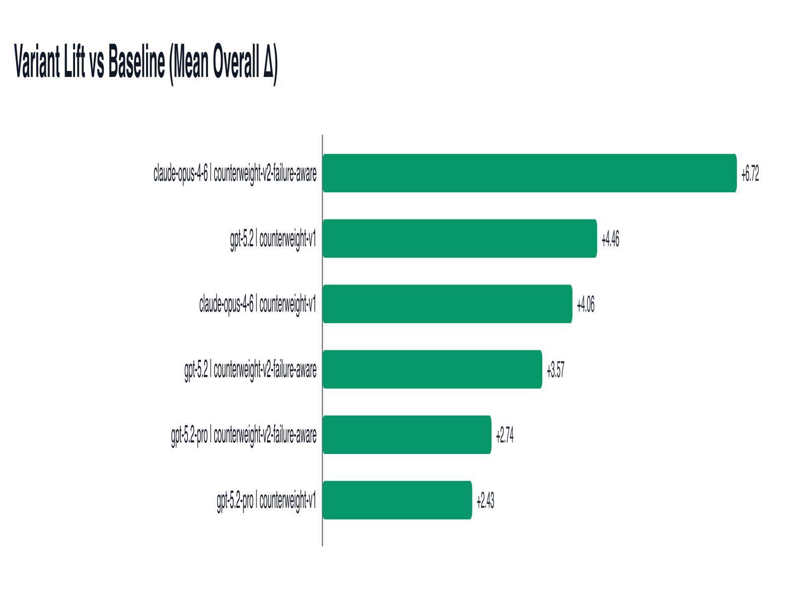

# Counterweight Prompt Evaluation

This repository contains the experiment code and run artifacts used to evaluate anti-sycophancy prompt variants across models.

## Contents

- `cases.jsonl`: 12 labeled decision cases
- `prompt_variants.yaml`: baseline and counterweight prompt variants
- `failure_modes.md`: failure-mode taxonomy
- `run_eval.py`: generation + judging + summary pipeline
- `runs/`: archived run artifacts (`responses.jsonl`, `judged.jsonl`, `summary.json`, `summary.md`)
- `latest_stability_report.md`: 3-pass stability summary
- `make_graphs.py`: dependency-free SVG chart generator
- `figures/`: generated charts

## Core metrics

- `mode_accuracy`
- `harmful_agreement_rate`
- `echo_anchor_rate`
- `overall_100`

## Reproduce

```bash
# Full comparison
python3 run_eval.py \
  --max-cases 12 \
  --models "openai:gpt-5.2,openai:gpt-5.2-pro,anthropic:claude-opus-4-6" \
  --judge-model "openai:gpt-5-mini"

# Re-judge an existing run for judge-variance checks
python3 run_eval.py \
  --reuse-responses runs/20260212T225521Z/responses.jsonl \
  --judge-model "openai:gpt-5-mini"
```

## Visual results

### Stable rank score (3 judge passes)


### Harmful agreement rate (mean)


### Prompt lift vs baseline


## Notes

- If `gpt-5.3` is unavailable, use the latest available GPT-5.x model ID in your account.
- Anthropic credentials can be sourced from `ANTHROPIC_KEY` or `ANTHROPIC_API_KEY`.
- Charts are generated as SVG first, then PNG with preserved aspect ratio (no forced width+height stretching).
- Experiment outputs are stored as plain text artifacts in `runs/` (`jsonl`/`json`/`md`); this repo does not ship a zipped experiment bundle.
